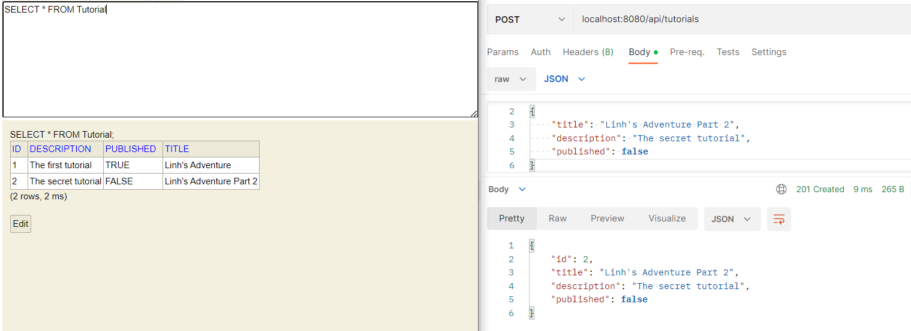
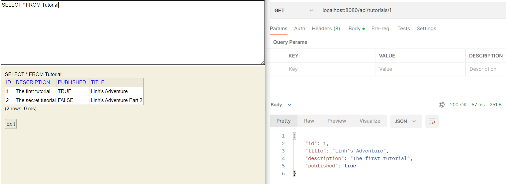
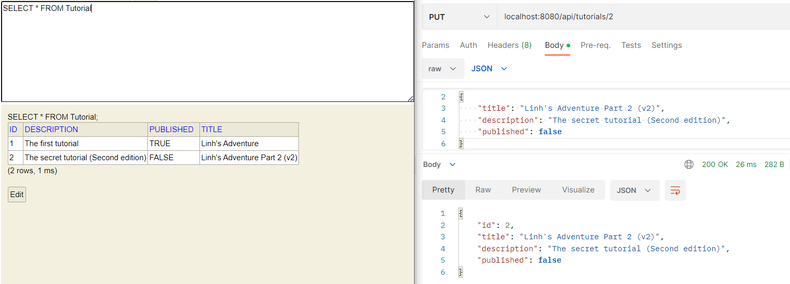
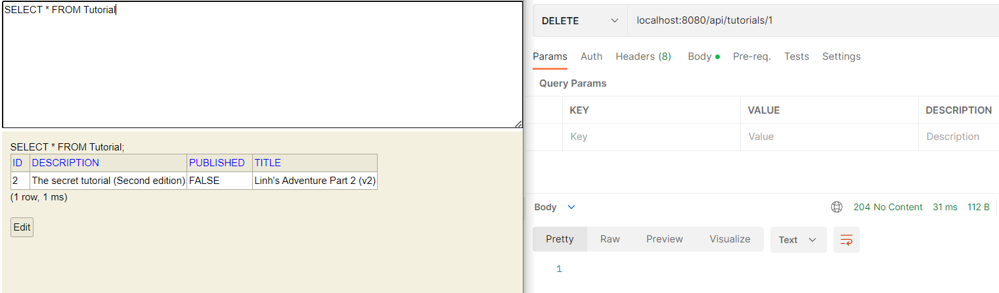
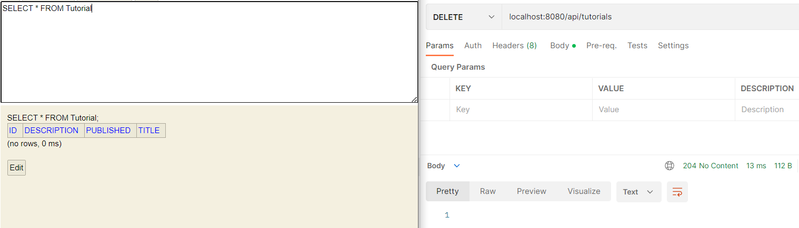
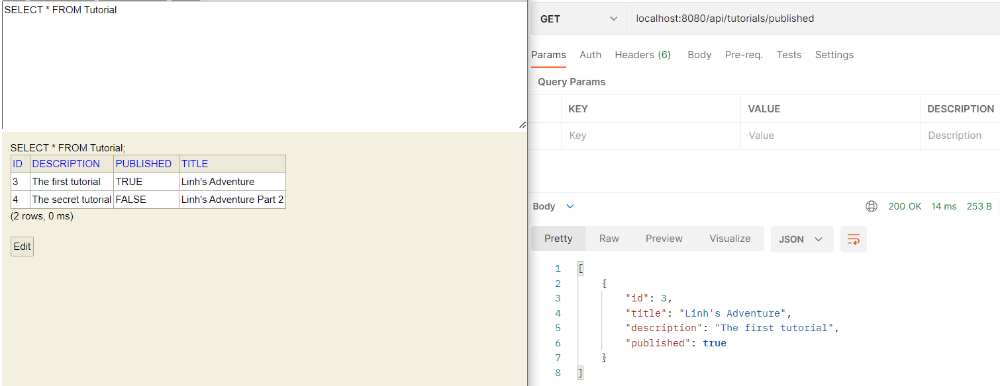
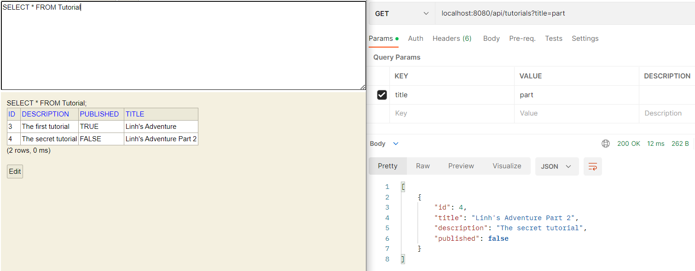

# Practice Project 1

## Table of contents
[1. Introduction](#introduction)  
[2. Results](#results)  
&nbsp;&nbsp;&nbsp;&nbsp;[2.1. POST /api/tutorials](#api-1)  
&nbsp;&nbsp;&nbsp;&nbsp;[2.2. GET /api/tutorials](#api-2)  
&nbsp;&nbsp;&nbsp;&nbsp;[2.3. GET /api/tutorials/:id](#api-3)  
&nbsp;&nbsp;&nbsp;&nbsp;[2.4. PUT /api/tutorials/:id](#api-4)  
&nbsp;&nbsp;&nbsp;&nbsp;[2.5. DELETE /api/tutorials/:id](#api-5)  
&nbsp;&nbsp;&nbsp;&nbsp;[2.6. DELETE /api/tutorials](#api-6)  
&nbsp;&nbsp;&nbsp;&nbsp;[2.7. GET /api/tutorials/published](#api-7)  
&nbsp;&nbsp;&nbsp;&nbsp;[2.8. GET /api/tutorials?title=[title]](#api-8)  

## Introduction
Full name: Nguyễn Hoàng Linh

## Results
### API 1
#### POST /api/tutorials
**Function**: Create a new tutorial    

### API 2
#### GET /api/tutorials
**Function**: Get all tutorials    

### API 3
#### GET /api/tutorials/:id
**Function**: Get a tutorial by ID    

### API 4
#### PUT /api/tutorials/:id
**Function**: Update a tutorial    

### API 5
#### DELETE /api/tutorials/:id
**Function**: Delete a tutorial by ID    

### API 6
#### DELETE /api/tutorials
**Function**: Delete all tutorials    

### API 7
#### GET /api/tutorials/published
**Function**: Get published tutorials    

### API 8
#### GET /api/tutorials?title=[title]  
**Function**: Get tutorials by title name    
